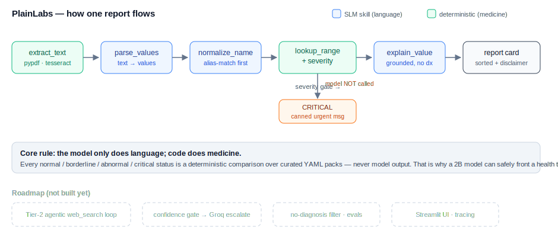

# 🩺 PlainLabs


Upload a lab report — get each value explained in plain language, flagged as normal,
borderline, abnormal, or **urgent**, with a shortlist of what to ask your doctor.
**Runs fully offline on a ~2B on-device model. Nothing leaves your machine.**

Your blood report is health data. You shouldn't have to paste it into a cloud chatbot
to understand it — and in a rural clinic with no internet, you can't. PlainLabs is built
for exactly that: a small quantized model does all the *language*, while a deterministic
safety layer does all the *medicine*.

## The one idea

> **The model only does language. Code does medicine.**

Every `normal / borderline / abnormal / critical` status is a deterministic comparison
against curated reference data — **never** model output. The small language model is kept
on a short leash: it reads the messy report into structured values and phrases the
explanations, but it is never allowed to decide whether a number is dangerous. That split
is what makes a small model safe to put in front of a health tool.

### The model: MedGemma 4B

PlainLabs runs on [MedGemma 4B](https://deepmind.google/models/gemma/medgemma/) — Google's
medically-tuned Gemma 3, trained on medical text and, notably, on **extracting structured
data from unstructured lab reports** (exactly our parsing task). It runs locally via Ollama
(~3.3 GB). Two things to be clear about:

- MedGemma is **not clinical-grade** and Google says its outputs must not directly drive
  diagnosis. PlainLabs honours that by design — the model never makes the medical call.
- It is licensed under Google's [Health AI Developer Foundations](https://developers.google.com/health-ai-developer-foundations/medgemma)
  terms (the model, not this repo's MIT-licensed code). You pull the weights yourself.

The model is a config value — set `PLAINLABS_SLM` to any Ollama model (`llama3.2:3b`,
`gemma4:e2b-it-qat`, …). Nothing in the architecture depends on the choice.

## Architecture



```
extract_text → parse_values → normalize_name → lookup_range + severity → explain_value → report card
   (code)         (SLM)           (SLM)              (code, safety)          (SLM)
```

Built as a [LangGraph](https://langchain-ai.github.io/langgraph/) `StateGraph` so each
step is an isolated, testable node — and so the roadmap items (agentic search, escalation)
become new *edges*, not a rewrite.

## What works today

- **Deterministic safety core** — reference-range lookup, severity classification, critical
  hard-stop, and a report-vs-reference **conflict guard** that routes to a cautious path
  instead of guessing. Covered by unit tests that must stay 100% correct.
- **20 knowledge packs** across the 8 common panels: CBC, diabetes, lipids, thyroid, liver
  (LFT), kidney (KFT), electrolytes, vitamins. Each pack is one YAML file — the contribution
  surface (see [CONTRIBUTING.md](CONTRIBUTING.md)).
- **Report-printed ranges preferred.** Labs calibrate their own instruments, so the report's
  own reference range wins; packs are the fallback and the source of explanation text.
- **Reverse-band tests handled** — HDL and Vitamin D, where *low* is the concern, classify
  correctly, not just "high = bad".
- **Three SLM skills**: `parse_values` (pipe-delimited lines, not JSON — small models follow
  a simple template far more reliably), `normalize_name` (exact alias-match first, model only
  for the unknowns, and its answer is verified against the real id set), `explain_value`
  (grounded in pack text, instructed never to diagnose).
- **Safety output**: severity-sorted report card, canned urgent message for critical values
  (the model is never asked to phrase those), and a disclaimer on every result.
- **CLI**: `python -m plainlabs <report.pdf|.png|.txt>`.

### Example

```
$ python -m plainlabs evals/golden/report_basic.txt

[ABNORMAL]   HDL Cholesterol: 38.0 mg/dL
    Your HDL ("good") cholesterol is below the desirable level, a heart-disease risk factor…
[ABNORMAL]   Vitamin D (25-OH): 18.0 ng/mL
    Your Vitamin D is lower than normal, which can affect calcium absorption and bone health…
[BORDERLINE] HbA1c: 6.1 %
    Slightly outside the normal range — average blood sugar has been a little higher…
[NORMAL]     Hemoglobin: 14.2 g/dL
    Within the normal range — enough oxygen-carrying protein in your red blood cells…

This is an automated explanation for general understanding only. It is not a diagnosis.
Always discuss your results with a doctor.
```

## Run it

```bash
# 1. Model (~3.3 GB, one time)
brew install ollama       # or https://ollama.com
ollama serve              # in its own terminal
ollama pull medgemma:4b   # or set PLAINLABS_SLM=llama3.2:3b

# 2. Python env (uv: https://docs.astral.sh/uv/)
uv sync
brew install tesseract         # only needed for photo (image) reports

# 3. Explain a report
uv run python -m plainlabs evals/golden/report_basic.txt
```

Everything is a config value in [plainlabs/config.py](plainlabs/config.py) — the model is a
*config* choice, not an architecture decision. Swap `PLAINLABS_SLM` for any Ollama model.

## Tests

```bash
uv run pytest            # safety core: range, severity, critical, conflict guard
```

## Roadmap (not built yet)

Honestly scoped — these are designed in [docs/PRD.md](docs/PRD.md) but not implemented:

- **Tier-2 agentic loop** — for a test not in the packs: an SLM `decide` step chooses to
  web-search (restricted to trusted medical sources), extract the range, self-check, then
  explain or escalate. Today, unknown tests are listed as "needs a doctor" instead.
- **Confidence-gated escalation** — self-consistency + schema validation; low-confidence
  cases escalate to a larger model (Groq), with a `--local-only` flag. The heterogeneous
  SLM+LLM cascade from [NVIDIA's SLM-agents thesis](https://arxiv.org/abs/2506.02153).
- **No-diagnosis guardrail filter** — a deterministic pass that blocks diagnostic phrasing.
- **Eval harness** — golden reports scored on extraction accuracy, range correctness, and
  explanation groundedness.
- **Streamlit UI** and **LangSmith tracing**.

## Safety & scope

PlainLabs is a health-**literacy** tool, not a diagnostic one. It explains what values mean
and never names a condition you "have" or suggests treatment. Specialized reports
(pathology, radiology, genetics, tumor markers) are out of scope. Always consult a doctor.

## License

MIT — see [LICENSE](LICENSE).
